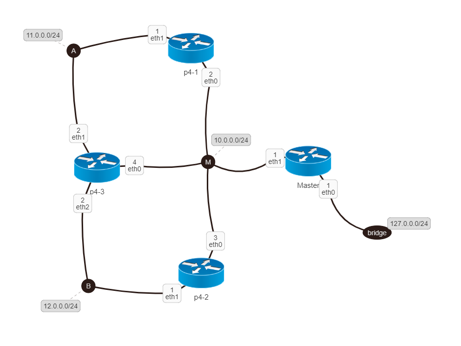

# P4 Management over Netkit
A managing application that allows to control P4 switches in a Netkit environment. 

NB: this is a test application, there is no security enforcement and should not be used in production. 

## How does it work
Master and Slaves are on the same LAN. Master is 10.0.0.1, slaves have the same subnet, ranging from .2 to .254. 
The master is also on the Doker bridge, exposing port 3000.

- Master:
  - /detect -> requests to all Slaves. If they respond they are added as subscribers (the list is emptied before). 
  - /subscribe -> adds the IP address of the request as a subscribers.
  - /update -> shows a form to send a P4 and cpu code to all subscribers.
  
- Slave:
  - automatic message to 'master/subscribe' to subscribe on startup.
  - /update -> attached files are copied, previous P4 processes are killed and the new files are compiled and run.
  
  
## Test
To test it you need to install Docker and [Netkit-Doker](https://github.com/Kidel/Netkit-Python-Docker-core), then simply go to the lab folder and run start_lab. It will automatically generate the following network. Then simply go to localhost:3000 to access the front end. 

